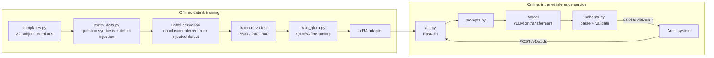

# Exam Question Auditing LLM

Fine-tuning a general-purpose LLM into a specialized model that **emits audit verdicts in a fixed structure only**, deployed on the intranet to replace a workflow where staff manually copy-pasted exam questions into external web-based AI services.

**The core requirement is compliance, not efficiency.** The original workflow uploaded unpublished exam questions, answer keys, and worked solutions to third-party services (Doubao, DeepSeek, etc.) — that is a data leak. Leadership's requirement was that data stay on the intranet. That constraint is hard; everything else is secondary.

**[English](README.md) | [中文](README.zh.md)**

---

## What this repository is

A **runnable** end-to-end implementation: synthetic training data, QLoRA fine-tuning, head-to-head evaluation, a FastAPI service, and Docker delivery artifacts.

The runtime environment needs to be stated plainly: **this machine is an Apple Silicon Mac (M1 Pro / 16GB unified memory) with no NVIDIA GPU.** So what actually ran here is Qwen2.5-0.5B with plain LoRA. The 24GB single-GPU + 4-bit QLoRA + vLLM setup is the **target environment** — the code and configs are written for it and ship with the repo, but **cannot actually be executed on this machine**.

That is not an omission; it is labeled honestly. Which numbers were really produced here and which need a GPU box is stated everywhere it matters.

## Key design decision: why the primary metric is "format compliance", not "accuracy"

The downstream consumer is a database and a human review queue. **Output that isn't structurally valid never reaches the database** — at which point whether the audit judgment was correct is irrelevant; an arbitrarily high accuracy is worth zero. So the engineering focus is on making the model emit valid structures reliably.

| Metric | Definition | Why it matters |
|---|---|---|
| **Format compliance** (primary) | Share of outputs that parse into a valid `AuditResult` | Decides whether data can be ingested at all |
| Bare JSON rate (diagnostic) | Share valid *without* fault-tolerant extraction | Catches fake compliance that only survived post-processing |
| Conclusion / risk accuracy | Denominator is **all** samples; format failures count as wrong | Probability of getting a correct verdict end-to-end |

Exact metric definitions — and why the denominator for field accuracy must be all samples rather than the format-valid subset — are in **[docs/metrics.md](docs/metrics.md)** (Chinese).

## Architecture



Three core modules; everything else depends on them, and they depend on nothing else:

- **[taxonomy.py](src/audit_llm/taxonomy.py)** — the auditing rule system. Change the standard and you edit this one file; data synthesis, training labels, and evaluation all follow.
- **[schema.py](src/audit_llm/schema.py)** — the format contract. "What counts as valid output" is defined here and nowhere else.
- **[prompts.py](src/audit_llm/prompts.py)** — training and inference **share the same** prompt-construction code, eliminating train/serve skew.

Design trade-offs are discussed in **[docs/architecture.md](docs/architecture.md)** (Chinese).

## Quick start

Requirements: Python 3.10+, ~5GB disk (including the 0.5B model). An NVIDIA GPU makes it much faster, but the full pipeline runs without one.

```bash
git clone https://github.com/maowenli7-debug/exam-question-audit.git && cd exam-question-audit
pip install -r requirements.txt

# 0. Sanity check: dependencies, device, model, data
make check-env

# 1. Download the model (~1GB, via ModelScope)
modelscope download --model Qwen/Qwen2.5-0.5B-Instruct \
    --local_dir models/Qwen2.5-0.5B-Instruct

# 2. Generate data (deterministic; fixed seed, identical on any machine)
make data

# 3. Smoke training: 20 samples, 2 minutes. Confirm the pipeline works before a full run
make smoke

# 4. Full training
make train

# 5. Comparative evaluation: base vs fine-tuned
make eval

# 6. Start the service
make serve
curl -s localhost:8000/healthz | python -m json.tool
```

`make help` lists every target.

### Calling the audit endpoint

> **Note on the Chinese values below.** The enum values in `taxonomy.py` — subject (`物理` = physics), stage (`初中` = junior high), conclusion (`通过` = pass), risk level (`低` = low), issue types — are **Chinese strings in the code itself**. They are not translated here because translating them would make the example invalid. The model is trained on Chinese input and emits these exact values.

```bash
curl -s -X POST localhost:8000/v1/audit \
  -H 'Content-Type: application/json' \
  -d '{
    "question": {
      "id": "q1",
      "subject": "物理",
      "stage": "初中",
      "stem": "一个物体在水平面上做匀速直线运动，它受到的摩擦力为 5N，则水平方向上的拉力是多少？",
      "options": {"A": "0N", "B": "5N", "C": "10N", "D": "无法确定"},
      "answer": "B",
      "explanation": "匀速直线运动说明物体受力平衡，水平方向上拉力与摩擦力大小相等、方向相反，故拉力为 5N。"
    }
  }' | python -m json.tool
```

Response:

```json
{
  "result": {
    "conclusion": "通过",
    "risk_level": "低",
    "issues": [],
    "suggestion": ""
  },
  "raw_output": "{\"conclusion\":\"通过\",...}",
  "needs_extraction": false,
  "latency_ms": 1832
}
```

`needs_extraction` is a warning signal for callers: `true` means the model wrapped its output in a code fence or added stray text, and the JSON was only recovered by fault-tolerant extraction — the format is not actually stable.

### Integrating with an existing system

Beyond the business endpoint `/v1/audit`, the service also exposes an **OpenAI-compatible `POST /v1/chat/completions`**.

This is deliberate. The original audit system called an external web AI, and the interface shape was the chat one. With a compatible endpoint, the integrator only changes `base_url` from the external service to the intranet address — **"data never leaves the intranet" becomes a one-line config change**, with no business-logic changes. Integration cost is what determines whether a project like this actually ships.

## Data

**Fully synthetic. No external dataset is used.**

The 2500 training samples are built in three steps:

1. **Generate a question that is free of defects** — 22 subject templates; the template itself guarantees the question is self-consistent (unique correct answer, explanation matching the answer)
2. **Inject known defects** — probabilistically inject 0–2, drawing defect types from the taxonomy
3. **Derive the audit verdict from what was injected** — inject a high-risk subject-matter error and the label *is* "reject / high risk"

**The label is a by-product of the injection action, not the output of a model judgment.** This matters: if you have an LLM generate questions and then have an LLM label them, using that to evaluate yet another model is circular. Here the ground truth comes from the construction process.

Every injected sample is run through an `Injection.verify` self-check to confirm the defect is genuinely still present in the final text — the test suite has in fact caught a case where two injectors interfered with each other and invalidated a label (the formatting injector appended a comma to one of two duplicate options, which broke the "options are identical" label).

### Split isolation

Isolation is enforced at the level of the **base question** (the clean question before defect injection). The three splits are **pairwise disjoint** at that level:

| Check | Result |
|---|---|
| train ∩ test | **0** |
| train ∩ dev | **0** |
| dev ∩ test | **0** |

Without this, the test set would just be the training set "broken a different way", and the metrics would be inflated.

Full distribution statistics and **known limitations** are in **[data/STATS.md](data/STATS.md)** (Chinese) — including the 60% question duplication rate and why the defect-type distribution deviates from the configured weights. These are real shortcomings, written down in the repo rather than hidden.

## Training

The LoRA hyperparameters are **identical** between this machine and the target environment, so moving to a GPU box requires no re-tuning:

| | This machine (actual) | Target environment |
|---|---|---|
| Base model | Qwen2.5-0.5B-Instruct | Qwen2.5-7B-Instruct |
| Quantization | none (MPS has no bitsandbytes) | 4-bit nf4 + double quant |
| LoRA r / alpha | 16 / 32 | 16 / 32 |
| target_modules | all linear layers (7) | same |
| Device | Apple MPS | single 24GB CUDA GPU |
| Config file | `configs/qlora_qwen2.5-0.5b.yaml` | `configs/qlora_qwen2.5-7b.yaml` |

The training script **degrades automatically by device**: on non-CUDA hardware it disables 4-bit quantization and prints a prominent warning. This is not a fallback — it is the only way to actually run on this machine, since bitsandbytes' 4-bit path has no MPS implementation.

### Two pitfalls on Apple Silicon (both handled in code)

**1. The memory bottleneck is the logits, not the model weights.** The 0.5B model's fp32 weights are only 2GB, but the vocabulary is 151936, so a single forward pass produces a logits tensor of `batch × seq × 151936 × 4B` — at batch=4 and seq≈800 that is 1.9GB for one copy, and backpropagation needs another while `cross_entropy` promotes to fp32. Batch=4 OOMs outright in practice. The local config therefore forces `batch=1 × accum=16` (still an effective batch of 16). `per_device_eval_batch_size` must also be set explicitly to 1 — its default is 8, and leaving it would blow up hours into training, at the first validation pass.

**2. PEFT + gradient checkpointing makes the loss flatline.** During recomputation the input tensor's `requires_grad` is `False`, so gradients never reach the LoRA layers — **and no error is raised**. `prepare_model_for_kbit_training()` handles this internally, but the non-quantized path requires calling `enable_input_require_grads()` manually.

To run real training on a CUDA machine, see **[docs/runbook_cuda.md](docs/runbook_cuda.md)** (Chinese).

## Evaluation

<!-- EVAL_RESULTS_START -->
Base and fine-tuned models each ran over the 300-sample test set. **These numbers were really produced on this machine.** The full report is at **[reports/eval_report.md](reports/eval_report.md)** (Chinese).

| Metric | Base model | Fine-tuned | Change |
|---|---:|---:|---|
| Format compliance (primary) | 99.0% | **100.0%** | ↑ 1.0 pp |
| └ of which "bare JSON" | **10.3%** | **100.0%** | ↑ 89.7 pp |
| └ required extraction to pass | 266 | 0 | — |
| Audit conclusion accuracy | 54.7% | **79.0%** | ↑ 24.3 pp |
| Risk level accuracy | 31.0% | **79.0%** | ↑ 48.0 pp |
| Issue-type F1 | 0.000 | **0.830** | ↑ 0.830 |

### How to read this table

**The primary metric saturated at this scale, and it hides the real difference.** It has three levels of fault-tolerant extraction behind it — any output from which a valid JSON *can be sliced out* counts as passing. The base model loves wrapping JSON in a markdown fence (three backticks); strip that and it passes, yielding 99.0%. **266 of the 300 samples were rescued by post-processing**; only 10.3% emitted clean JSON on their own.

The fine-tuning gain is hidden in the "bare JSON" column: **10.3% → 100.0%, with zero samples needing extraction.** That gain is more meaningful than the primary metric — production should not depend on downstream systems doing fault-tolerant extraction; that is itself a source of instability. The diagnostic metric next to the primary one is not decoration; it is the only metric that carried signal here.

**The base model's 54.7% "conclusion accuracy" is a guess.** It answered `通过` (pass) in 297 of 300 cases with `issues` always an empty array — it never reported a single issue. The test set happens to contain exactly 54.7% "pass" samples, so answering "pass" unconditionally scores that number. **It learned the shape of the output, not how to audit.**

### Recall by issue type

Aggregate F1 averages away the case where one class is nearly undetectable. Broken out:

| Issue type | Ground-truth count | Base recall | Fine-tuned recall |
|---|---:|---:|---:|
| **Subject-matter error** (`学科错误`) | **78** | 0.0% | **53.8%** |
| Malformed formatting (`格式不规范`) | 53 | 0.0% | 86.8% |
| Ambiguous wording (`表述歧义`) | 48 | 0.0% | 64.6% |
| Out of syllabus (`超纲`) | 27 | 0.0% | 96.3% |
| Sensitive phrasing (`敏感表述`) | 19 | 0.0% | 84.2% |

Precision is 98.8% (only 2 false positives), but **misses are heavily concentrated in subject-matter errors**: 36 of the 64 missed detections are that class, 56% of all misses.

The ordering itself reveals the cause (sorted here by recall, ascending). **The bottom two are exactly the classes that require actually understanding semantics:**

| Type | Recall | What the model actually has to do |
|---|---:|---|
| Subject-matter error | 53.8% | Detect "answer contradicts explanation" or "duplicate options" — a logical consistency check |
| Ambiguous wording | 64.6% | Notice the stem replaced concrete values with vague words like "several", removing a necessary condition |
| Malformed formatting | 86.8% | Check for missing units, trailing comma vs. period — regex matches this |
| Out of syllabus | 96.3% | Judge whether terminology exceeds the grade band — essentially a lookup |
| Sensitive phrasing | 84.2% | See the caveat below |

In other words, what this 0.5B model learned is mostly **templatable surface patterns**; genuine semantic auditing ability is still weak. That is far more useful than a bare F1 of 0.830 — it points directly at where the next investment should go: for the two classes requiring reasoning, adding more data of the same kind has limited returns.

**But the 84.2% for sensitive phrasing deserves a discount.** The injected sensitive content is drawn from `synth_data._SENSITIVE_BANK`, a **fixed short word list** (a dozen or so phrases), so the model may simply be recognizing those phrases rather than judging whether content is appropriate. The high score for this class **partly reflects how the data was constructed, not real-world sensitivity detection** — sensitive content in real review is an open set, and memorizing a word list does not generalize.

### Relationship to the "55% → 91%" on my résumé

**These numbers do not reproduce the résumé's 55% → 91%, and should not be expected to.** The two are not comparable:

| | Résumé | This repo |
|---|---|---|
| Base model | Qwen2.5-**7B** | Qwen2.5-**0.5B** |
| Data | EduData real questions | Fully synthetic (templated; far lower linguistic complexity than real exams) |
| Prompt | unknown | empty skeleton + field-value description (see `prompts.py`) |
| Parsing | unknown | three-level fault-tolerant extraction (**permissive, which inflates the base model's numbers**) |

That last row is the key one: the parser is deliberately permissive, because a real downstream system cannot discard a result just because the model added an extra sentence. The cost is that the primary metric is inflated.

**A different framing makes it clearer:** under the stricter "bare JSON" definition, this repo's base model does not start at 99.0% but at **10.3%**. That order of magnitude is at least in the same conversation as the résumé's "55%" — though still **not directly comparable**, since both the model (0.5B vs. 7B) and the data (synthetic vs. real questions) differ. What can be said is this: **the claim "the base model already has a high format compliance rate" depends entirely on how permissive the parser is.** The same outputs are 99% under a permissive definition and 10.3% under a strict one.

Auditing ability on real exam questions cannot be assessed with this synthetic data — the linguistic complexity is far too different. See "Known limitations" in [data/STATS.md](data/STATS.md).

<!-- EVAL_RESULTS_END -->

Evaluation protocol: greedy decoding (reproducible results); base and fine-tuned models run the same test set, the same prompt, and the same parser.

## Deployment

```bash
# Merge LoRA into the base weights (shortest inference path)
python scripts/merge_adapter.py \
    --base models/Qwen2.5-0.5B-Instruct \
    --adapter outputs/qwen2.5-0.5b-lora \
    --out models/merged

# Docker (requires an NVIDIA GPU)
docker compose -f deploy/docker-compose.yml up -d
```

The service is split into two layers: **vLLM handles high-throughput inference** (listening only on the container-internal port 8001), and **FastAPI handles business orchestration** (port 8000, externally facing, doing prompt rendering and structural validation). Swapping models touches only the vLLM layer; changing audit rules touches only the FastAPI layer.

The container sets `HF_HUB_OFFLINE=1` / `TRANSFORMERS_OFFLINE=1` — not a performance optimization, but a runtime backstop for "data never leaves the intranet".

## Project structure

```
src/audit_llm/
  taxonomy.py      audit rule system (classification / risk / conclusion derivation)
  schema.py        structured definitions and three-level fault-tolerant parsing
  prompts.py       prompt construction shared by training and inference
  templates.py     22 subject question templates
  synth_data.py    defect injection and label derivation
  train_qlora.py   QLoRA training (device-adaptive)
  infer.py         transformers inference backend
  evaluate.py      evaluation metrics
  api.py           FastAPI service
scripts/           CLI entry points (build data / eval / env check / merge weights)
configs/           training configs (0.5B local / 7B target)
deploy/            Dockerfile, compose, vLLM launch script
docs/              architecture, CUDA runbook, metric definitions
tests/             50 tests
```

## Roadmap

### Done

- [x] Audit taxonomy and structured schema (including three-level fault-tolerant parsing)
- [x] Synthetic data pipeline: template generation → defect injection → label derivation → post-injection self-check
- [x] Data splits disjoint at the base-question level
- [x] QLoRA training script (device-adaptive; one codebase for local and CUDA targets)
- [x] Real local training producing a LoRA adapter
- [x] Base vs. fine-tuned comparative evaluation
- [x] FastAPI service (business endpoint + OpenAI-compatible endpoint)
- [x] Docker / vLLM delivery artifacts
- [x] Complete documentation

### Not done (deliberately out of scope, not overlooked)

- [ ] **Formal 7B training on a single 24GB GPU.** Configs and runbook are ready; this machine has no NVIDIA GPU. See [docs/runbook_cuda.md](docs/runbook_cuda.md).
- [ ] **Integrate a real question bank and re-evaluate.** The current test set is synthetic, with far lower linguistic complexity than real exam questions; the metrics **must not** be extrapolated.
- [ ] **End-to-end integration with the audit system.** The interface is designed for that shape, but there is no real downstream system to connect to.
- [ ] **Concurrency load testing and capacity planning.** vLLM's throughput parameters (`--gpu-memory-utilization`, `--max-model-len`) need tuning against real VRAM and QPS.
- [ ] **Model quality tuning.** Data mixing, hyperparameter search, rejection sampling, DPO alignment — none of it done yet.
- [ ] **A continuous iteration process for changes to the audit standard.** Editing `prompts.py` requires retraining, but there is no automated regression check for it yet.

### Known limitations

- The 2500 training samples come from only 988 base questions (60% duplication). The root cause is that 13 rote-recall templates have fixed stems yet account for roughly 60% of all draws — a different quantity from the duplication rate, though coincidentally a similar figure. See [data/STATS.md](data/STATS.md).
- The actual defect-type distribution deviates from the configured weights, due to applicability constraints (e.g. "out of syllabus" is only injected at the junior-high level).
- **Semantic defects are the clear weak spot**: subject-matter errors have only 53.8% recall (56% of all misses) and ambiguous wording 64.6%, while surface-feature classes all sit above 84%. What the model learned is mostly templatable patterns.
- **The sensitive-phrasing recall is inflated by how the data was built**: injected content comes from a fixed short word list, so the model may have simply memorized those phrases. Real-world sensitive content is an open set; this score does not extrapolate.
- Audit dimensions are defined by rules, not by real reviewers' judgment.

## Development

```bash
make test        # 50 tests
make check-env   # environment sanity check
```

The tests cover **pitfalls actually hit**, not line coverage:

- Label/text consistency (an injected defect must genuinely still be present in the final text)
- Split isolation (base questions disjoint)
- Prompt contract (copying the format skeleton verbatim must fail validation; every issue type must be described in the prompt)
- Training labels must be accepted by the inference-side parser
- All four conclusion branches of the evaluation report (improvement / flat / **regression** / primary-metric saturation), including the hardest one to trigger
- The numbers in the report's tables and its conclusion paragraph must use the same definition (two of them genuinely disagreed at one point)
- **Core logic must not transitively depend on torch** — report rendering must be importable in an environment with only pydantic installed. This one asserts in a subprocess, because torch *is* installed locally and the failure is invisible in-process (it is exactly how the first CI run broke)

## License

For learning and internal use only.
