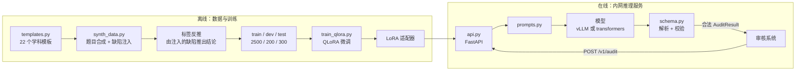

# 命题审核 LLM

**[English](README.md) | [中文](README.zh.md)**

把一个通用大模型微调成**只输出固定结构审核结论**的专用模型，部署在内网，替代「人工把题目复制到外部网页 AI 判断」的流程。

**核心诉求不是效率，是合规。** 原流程把未公开的命题、答案、解析上传到豆包 / DeepSeek 等外部服务，这是数据泄露。领导的要求是数据走内网——这一条是硬约束，其他都是附带的。

---

## 这个仓库是什么

一份**可运行**的完整实现：从合成训练数据、QLoRA 微调、对比评测，到 FastAPI 服务与 Docker 交付。

需要说清楚的是运行环境：**本机是 Apple Silicon（M1 Pro / 16GB 统一内存），没有 NVIDIA 显卡。** 所以实际跑的是 Qwen2.5-0.5B + 纯 LoRA，而 24GB 单卡 + 4-bit QLoRA + vLLM 是**目标环境配置**，代码和配置都已按那个环境写好并随仓库提供，但**本机无法真实执行**。

这不是省略，而是如实标注。哪些数字是本机真跑出来的、哪些需要 GPU 机器，下面每一处都会写明。

## 关键设计：为什么主指标是「格式遵循率」而不是「准确率」

下游是数据库和人工复核队列。**格式不合法的输出根本进不了库**——此时审核判断对不对毫无意义，准确率再高也是零。所以技术重心放在「让模型稳定输出合法结构」上。

| 指标 | 口径 | 为什么重要 |
|---|---|---|
| **格式遵循率**（主） | 输出能解析成合法 `AuditResult` 的样本占比 | 决定数据能不能入库 |
| 裸 JSON 率（诊断） | 未经容错提取就合法的占比 | 识别「靠后处理救回来」的假达标 |
| 结论 / 风险准确率 | 分母是**全量**样本，格式失败记错 | 端到端拿到正确结论的概率 |

指标的精确定义、以及为什么字段准确率的分母必须是全量而非「格式合法子集」，见 **[docs/metrics.md](docs/metrics.md)**。

## 架构



三个核心模块，其余全部依赖它们、它们不依赖任何其他模块：

- **[taxonomy.py](src/audit_llm/taxonomy.py)** — 审核规则体系。审核标准变了只改这一个文件，数据合成、训练标签、评测口径同时跟着变。
- **[schema.py](src/audit_llm/schema.py)** — 格式契约。「什么叫输出合法」完全由它定义。
- **[prompts.py](src/audit_llm/prompts.py)** — 训练与推理**共用同一份** prompt 构造代码，杜绝 train/serve skew。

详细设计取舍见 **[docs/architecture.md](docs/architecture.md)**。

## 快速开始

环境要求：Python 3.10+，约 5GB 磁盘（含 0.5B 模型）。有 NVIDIA 显卡会快很多，但没有也能跑通全流程。

```bash
git clone https://github.com/maowenli7-debug/exam-question-audit.git && cd exam-question-audit
pip install -r requirements.txt

# 0. 自检：依赖、设备、模型、数据是否就位
make check-env

# 1. 下载模型（约 1GB，走 ModelScope 国内直连）
modelscope download --model Qwen/Qwen2.5-0.5B-Instruct \
    --local_dir models/Qwen2.5-0.5B-Instruct

# 2. 生成数据（确定性，固定 seed，任何机器结果一致）
make data

# 3. 冒烟训练：20 条样本，2 分钟。先确认链路通，别一上来就跑全量
make smoke

# 4. 全量训练
make train

# 5. 对比评测：基座 vs 微调
make eval

# 6. 起服务
make serve
curl -s localhost:8000/healthz | python -m json.tool
```

`make help` 可以看到全部目标。

### 调用审核接口

```bash
curl -s -X POST localhost:8000/v1/audit \
  -H 'Content-Type: application/json' \
  -d '{
    "question": {
      "id": "q1",
      "subject": "物理",
      "stage": "初中",
      "stem": "一个物体在水平面上做匀速直线运动，它受到的摩擦力为 5N，则水平方向上的拉力是多少？",
      "options": {"A": "0N", "B": "5N", "C": "10N", "D": "无法确定"},
      "answer": "B",
      "explanation": "匀速直线运动说明物体受力平衡，水平方向上拉力与摩擦力大小相等、方向相反，故拉力为 5N。"
    }
  }' | python -m json.tool
```

返回：

```json
{
  "result": {
    "conclusion": "通过",
    "risk_level": "低",
    "issues": [],
    "suggestion": ""
  },
  "raw_output": "{\"conclusion\":\"通过\",...}",
  "needs_extraction": false,
  "latency_ms": 1832
}
```

`needs_extraction` 是给调用方的告警信号：为 `true` 说明模型输出带了代码块或多余文字，是靠容错提取才拿到 JSON 的——格式并没有真正稳定。

### 接入已有系统

除了业务接口 `/v1/audit`，服务还提供 **OpenAI 兼容的 `POST /v1/chat/completions`**。

这是刻意的：原审核系统调的是外部网页 AI，接口形态就是 chat 那一套。有了兼容接口，接入方只需要把 `base_url` 从外部服务改成内网地址——**「数据不出内网」就变成了一行配置的改动**，不用改业务代码。接入成本决定了这个项目能不能真的落地。

## 数据

**完全合成，不依赖任何外部数据集。**

2500 条训练样本的构造分三步：

1. **生成一道没问题的题** —— 22 个学科模板，模板本身保证题目自洽（正确答案唯一，解析与答案一致）
2. **注入已知缺陷** —— 按概率注入 0~2 个，缺陷类型取自 taxonomy
3. **由注入的缺陷反推审核结论** —— 注入的是高风险学科错误，标签就是「不通过 / 高风险」

**标签是注入动作的副产品，不是模型判断的结果。** 这是关键：如果让大模型生成题目再让大模型给结论，拿它去评测另一个模型就是循环论证。这里的基准真值来自构造过程。

注入后的样本会跑一遍 `Injection.verify` 自检，确认缺陷在最终文本里真的还在——测试里确实抓到过「两个注入器互相干扰导致标签失效」的情况（格式注入器给重复选项之一加了逗号，于是「选项完全相同」这个标签就不成立了）。

### 切分隔离

隔离粒度是**底题**（注入缺陷之前的干净题目），三个切分在底题层面**两两完全不相交**：

| 检查项 | 结果 |
|---|---|
| 训练 ∩ 测试 | **0** |
| 训练 ∩ 验证 | **0** |
| 验证 ∩ 测试 | **0** |

不这么做的话，测试集里的题就只是训练集的「另一种坏法」，指标会虚高。

完整的分布统计和**已知局限**见 **[data/STATS.md](data/STATS.md)**——包括题目重复率 60%、缺陷类型分布偏离设定权重的原因。这些是真实的不足，写在仓库里而不是藏起来。

## 训练

LoRA 超参在本机与目标环境**完全一致**，换机器不需要重新调参：

| 项 | 本机实测 | 目标环境 |
|---|---|---|
| 基座模型 | Qwen2.5-0.5B-Instruct | Qwen2.5-7B-Instruct |
| 量化 | 无（MPS 不支持 bitsandbytes） | 4-bit nf4 + double quant |
| LoRA r / alpha | 16 / 32 | 16 / 32 |
| target_modules | 全部线性层（7 个） | 同左 |
| 设备 | Apple MPS | 单卡 24GB CUDA |
| 配置文件 | `configs/qlora_qwen2.5-0.5b.yaml` | `configs/qlora_qwen2.5-7b.yaml` |

训练脚本**按设备自动降级**：检测到非 CUDA 时会关掉 4-bit 量化并打印醒目警告。这不是兜底，而是唯一能在这台机器上真实跑通的方式——bitsandbytes 的 4-bit 没有 MPS 实现。

### 本机跑的两个坑（都已在代码里处理）

**1. 显存瓶颈不是模型权重，是 logits。** 0.5B 的 fp32 权重才 2GB，但 vocab 151936，一次前向的 logits 张量是 `batch × seq × 151936 × 4B`——batch=4、seq≈800 时单个就是 1.9GB，反传要再存一份，`cross_entropy` 还会升到 fp32。实测 batch=4 直接 OOM。所以本机配置强制 `batch=1 × accum=16`（等效 batch 仍是 16）。`per_device_eval_batch_size` 也必须显式设成 1——它的默认值是 8，不改的话会在训练跑了几小时后、第一次验证时才炸掉。

**2. PEFT + gradient checkpointing 会让 loss 平着不降。** 重算时输入张量的 `requires_grad` 是 `False`，梯度传不到 LoRA 层，而且**不报任何错**。`prepare_model_for_kbit_training()` 内部会处理这件事，但非量化路径必须手动补 `enable_input_require_grads()`。

要在 CUDA 机器上跑正式训练，见 **[docs/runbook_cuda.md](docs/runbook_cuda.md)**。

## 评测

<!-- EVAL_RESULTS_START -->
在 300 条测试集上，基座与微调各跑一遍。**以下是本机真实跑出的数字**，完整报告见 **[reports/eval_report.md](reports/eval_report.md)**。

| 指标 | 基座模型 | 微调模型 | 变化 |
|---|---:|---:|---|
| 格式遵循率（主指标） | 99.0% | **100.0%** | ↑ 1.0 pp |
| └ 其中「裸 JSON」 | **10.3%** | **100.0%** | ↑ 89.7 pp |
| └ 需容错提取才达标 | 266 条 | 0 条 | — |
| 审核结论准确率 | 54.7% | **79.0%** | ↑ 24.3 pp |
| 风险等级准确率 | 31.0% | **79.0%** | ↑ 48.0 pp |
| 问题类型 F1 | 0.000 | **0.830** | ↑ 0.830 |

### 读这张表要注意什么

**主指标（格式遵循率）在这个规模上饱和了，它掩盖了真实差异。** 它带三级容错提取兜底——只要输出文本里**能剥出**一个合法 JSON 就算达标。而基座模型很爱用 markdown 围栏（三个反引号）把 JSON 包起来，剥一下就达标，于是拿到 99.0%：**300 条里 266 条是靠后处理救回来的**，真正自己就输出干净 JSON 的只有 10.3%。

微调后的提升藏在「裸 JSON」这一列：**10.3% → 100.0%，且零条需要提取。** 这个增益比主指标更有实际意义——生产环境不该指望下游必须做容错提取，那本身就是不稳定的来源。所以主指标旁边那个诊断指标不是装饰，是这次唯一带信号的指标。

**基座模型的 54.7%「结论准确率」是蒙的。** 它 297/300 条一律回答「通过」、`issues` 恒为空数组——一个问题都没报出来。而测试集里判「通过」的样本恰好占 54.7%，所以一律答「通过」就能拿到这个数。**它学会了输出的「形状」，但没学会「审」。**

### 分问题类型的召回率

总 F1 会把「某类几乎查不出」平均掉，拆开看：

| 问题类型 | 真值条数 | 基座召回 | 微调召回 |
|---|---:|---:|---:|
| **学科错误** | **78** | 0.0% | **53.8%** |
| 格式不规范 | 53 | 0.0% | 86.8% |
| 表述歧义 | 48 | 0.0% | 64.6% |
| 超纲 | 27 | 0.0% | 96.3% |
| 敏感表述 | 19 | 0.0% | 84.2% |

精确率 98.8%（FP 仅 2），但**漏检高度集中在「学科错误」**：漏掉的 64 个里 36 个是它，占总漏检的 56%。

排序本身透露了原因（下表按召回从低到高排）。**最后两名恰好是两类需要真的读懂语义的**：

| 类型 | 召回 | 模型实际要做什么 |
|---|---:|---|
| 学科错误 | 53.8% | 算出「答案与解析矛盾」或「选项重复」——逻辑一致性检查 |
| 表述歧义 | 64.6% | 发现题干把具体数值换成了「若干」这类模糊词，缺了必要条件 |
| 格式不规范 | 86.8% | 看选项缺没缺单位、末尾是逗号还是句号——正则就能匹配 |
| 超纲 | 96.3% | 判断术语是否超出学段——基本是查表 |
| 敏感表述 | 84.2% | 见下方说明 |

也就是说，这个 0.5B 模型学到的主要是**可模板化的表层模式**，真正的语义审核能力还很弱。这比单看一个 0.830 的 F1 有用得多——它直接指出下一步该往哪投入：需要推理的那两类，靠继续加同类数据收效有限。

**但「敏感表述」那 84.2% 要打个折扣。** 注入的敏感内容取自 `synth_data._SENSITIVE_BANK` 这个**固定小词表**（十几个短语），所以模型可能只是认出了这几个短语，而不是真的在判断内容是否适宜。这一类的高分**部分来自数据构造方式，不代表真实场景的敏感内容识别能力**——真实审核里的敏感表述是开放集合，靠记词表没有用。

### 与简历里「55% → 91%」的关系

**这组数字没有复现简历里的 55% → 91%，也不应该期待复现**，两者不可比：

| | 简历 | 本仓库 |
|---|---|---|
| 基座模型 | Qwen2.5-**7B** | Qwen2.5-**0.5B** |
| 数据 | EduData 真实题目 | 全合成（模板化，语言复杂度远低于真实命题） |
| prompt | 未知 | 空骨架 + 字段取值说明（见 `prompts.py`） |
| 解析口径 | 未知 | 三级容错提取（**偏宽松，会把基座的裸 JSON 率抬高**） |

其中最后一行是关键：我的解析器是刻意做宽松的，因为真实下游不能因为模型多写了一句话就丢弃结果。代价就是主指标会被抬高。

**换个口径看会更清楚**：如果按「裸 JSON」这个更严的口径算，本仓库基座的真实起点不是 99.0%，而是 **10.3%**。这个量级和简历里的「55%」才算能对话——但仍然**不能直接比**，因为模型（0.5B vs 7B）和数据（合成 vs 真实题目）都不同。可以说的是：**「基座模型输出格式遵循率很高」这个结论完全依赖于解析口径有多宽松**，同一份输出，宽松口径下是 99%，严格口径下是 10.3%。

真实题目上的审核能力无法用这份合成数据评估——题目语言复杂度差得太远。见 [data/STATS.md](data/STATS.md) 的「已知局限」。
<!-- EVAL_RESULTS_END -->

评测协议：贪心解码（结果可复现）、基座与微调跑同一份测试集 / 同一个 prompt / 同一套解析器。

## 部署

```bash
# 合并 LoRA 到基座权重（推理路径最短）
python scripts/merge_adapter.py \
    --base models/Qwen2.5-0.5B-Instruct \
    --adapter outputs/qwen2.5-0.5b-lora \
    --out models/merged

# Docker（需要 NVIDIA GPU）
docker compose -f deploy/docker-compose.yml up -d
```

服务分两层：**vLLM 负责高吞吐推理**（只监听容器内的 8001），**FastAPI 负责业务编排**（对外的 8000，做 prompt 渲染和结构校验）。换模型只动 vLLM 层，改审核规则只动 FastAPI 层。

容器内设了 `HF_HUB_OFFLINE=1` / `TRANSFORMERS_OFFLINE=1`——这不是性能优化，而是「数据不出内网」在运行时层面的兜底。

## 项目结构

```
src/audit_llm/
  taxonomy.py      审核规则体系（分类 / 风险 / 结论推导）
  schema.py        结构化定义与三级容错解析
  prompts.py       训练与推理共用的 prompt 构造
  templates.py     22 个学科题目模板
  synth_data.py    缺陷注入与标签反推
  train_qlora.py   QLoRA 训练（设备自适应）
  infer.py         transformers 推理后端
  evaluate.py      评测指标
  api.py           FastAPI 服务
scripts/           命令行入口（建数据 / 评测 / 环境自检 / 合并权重）
configs/           训练配置（0.5B 本机 / 7B 目标）
deploy/            Dockerfile、compose、vLLM 启动脚本
docs/              架构说明、CUDA 训练手册、指标口径
tests/             50 个测试
```

## Roadmap

### 已完成

- [x] 审核分类体系与结构化 Schema（含三级容错解析）
- [x] 合成数据管线：模板生成 → 缺陷注入 → 标签反推 → 注入后自检
- [x] 底题层面不相交的数据切分
- [x] QLoRA 训练脚本（设备自适应，本机与 CUDA 目标共用一份代码）
- [x] 本机真实训练产出 LoRA 适配器
- [x] 基座 vs 微调对比评测
- [x] FastAPI 服务（业务接口 + OpenAI 兼容接口）
- [x] Docker / vLLM 交付物
- [x] 完整中文文档

### 未完成（明确不做，不是遗漏）

- [ ] **24GB 单卡上的 7B 正式训练。** 配置与手册已就绪，本机无 NVIDIA 显卡。见 [docs/runbook_cuda.md](docs/runbook_cuda.md)。
- [ ] **接入真实业务题库并重新评测。** 现在的测试集是合成的，题目语言复杂度远低于真实命题，指标**不能**外推。
- [ ] **与审核系统联调。** 接口已按对接形态设计，但没有真实的下游系统可连。
- [ ] **并发压测与容量评估。** vLLM 的吞吐参数（`--gpu-memory-utilization`、`--max-model-len`）需要按真实显存和 QPS 调优。
- [ ] **模型效果调优。** 数据配比、超参搜索、拒绝采样、DPO 对齐——都还没做。
- [ ] **审核标准变更后的持续迭代流程。** 改 `prompts.py` 必须重训，但目前没有自动化的回归验证。

### 已知不足

- 训练集 2500 条只来自 988 个底题（重复率 60%），根因是 13 个纯记忆型模板题干固定却占了约六成采样量。详见 [data/STATS.md](data/STATS.md)。
- 缺陷类型实际分布与设定权重有偏差，根源是适用性限制（如「超纲」只对初中注入）。
- **语义类缺陷是明显短板**：「学科错误」召回仅 53.8%（占总漏检 56%）、「表述歧义」64.6%，而表层特征类的都在 84% 以上。模型学到的主要是可模板化的模式。
- **「敏感表述」的召回率被数据构造方式抬高了**：注入内容取自固定小词表，模型可能只是记住了那几个短语。真实场景的敏感内容是开放集合，这个分数不可外推。
- 审核维度由规则定义，不是真实审核员的判断标准。

## 开发

```bash
make test        # 50 个测试
make check-env   # 环境自检
```

测试覆盖的是**已知踩过的坑**，不是行覆盖率：

- 标签与文本一致性（注入的缺陷在最终文本里必须真的还在）
- 切分隔离（底题不相交）
- prompt 契约（格式骨架照抄必须校验失败；每类问题都必须在 prompt 里说明）
- 训练标签能被推理侧解析器接受
- 评测报告的四条结论分支（提升 / 持平 / **下降** / 主指标饱和），包括最难触发的那条
- 报告里表格与结论段的数字口径一致（这次真出过两处数字对不上）
- **核心逻辑不得传递性依赖 torch**——报表渲染必须在只装了 pydantic 的环境里能导入。
  这条用子进程断言，因为本地装着 torch，同进程里测不出来（CI 第一次跑就是这么挂的）

## 许可

仅供学习与内部使用。
