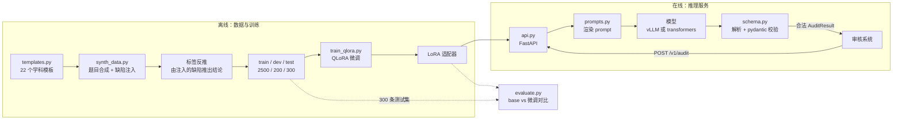

# 架构说明

## 业务背景

命题审核的原流程是：老师把题目**复制粘贴到豆包 / DeepSeek 等外部网页 AI**，看它怎么判断，再人工把结论整理成统一格式录入系统。

这条流程有三个问题，按严重程度排序：

1. **数据泄露。** 未公开的命题、答案、解析被上传到外部服务。这是合规问题，不是效率问题——领导的要求是「数据走内网」，这条是硬性约束，其他都是附带的。
2. **输出格式不统一。** 网页 AI 每次回答的结构、措辞、详略都不一样，人工整理成本高，且无法批量入库。
3. **效率低。** 复制粘贴 + 整理，单题耗时以分钟计。

本项目的解法是：**把一个 7B 模型微调成「只输出固定结构审核结论」的专用模型，部署在内网。** 审核系统调内网接口，数据不出内网，返回的是校验过的结构化 JSON，可以直接入库。

关键点在于**格式遵循率**是这里的主指标，而不是「审核得多准」。原因：审核系统的下游是数据库和人工复核队列，格式不合法 = 这条数据根本进不去，准确率再高也没用。所以整个项目的技术重心放在「让模型稳定输出合法结构」上。

## 数据流



## 分层与依赖方向

```
scripts/          命令行入口，只做参数解析和编排
    ↓
deploy/           Docker / vLLM 启动脚本
    ↓
src/audit_llm/
    api.py       FastAPI 服务层
    infer.py     推理后端（transformers）
    evaluate.py  评测指标
    train_qlora.py  训练
    synth_data.py   数据合成
    templates.py    题目模板
    prompts.py   ★ prompt 构造（训练与推理共用）
    schema.py    ★ 结构化定义与解析
    taxonomy.py  ★ 审核规则体系（分类、风险、结论推导）
```

三个 ★ 是整个系统的核心，所有其他模块都依赖它们，它们不依赖任何其他模块。这样设计的原因：

- **`taxonomy.py`** 是业务规则。审核标准变了（比如新增一类问题、调整风险等级到结论的映射），只改这一个文件，数据合成、训练标签、评测口径会同时跟着变，不会出现「数据用新标准、评测用旧标准」这种前后不一致。
- **`schema.py`** 是格式契约。它是「格式遵循率」这个指标的判定依据——什么叫「输出合法」完全由它定义。
- **`prompts.py`** 是训练/推理一致性的唯一保证。见下节。

## 最重要的一个设计决定：prompt 只有一份

训练时和推理时的 prompt **必须逐字节一致**，否则模型在训练时见到的是 A 分布、推理时见到的是 B 分布，表现会莫名其妙地掉——而且不报错，只是数字难看，很难排查。

常见做法是训练时用框架的对话模板、推理时手写拼接字符串，两边各写一遍。本项目不用这种方式：

```python
# prompts.py —— 训练和推理都调这一个函数
def build_messages(question: Question) -> list[dict[str, str]]: ...

# train_qlora.py
messages = build_messages(question)          # ← 同一个
full = tokenizer.apply_chat_template(messages + [assistant_msg], ...)

# infer.py
messages = build_messages(question)          # ← 同一个
prompt = tokenizer.apply_chat_template(messages, add_generation_prompt=True)
```

`train_qlora._render_pair()` 里还有一层保护：它断言「带 `add_generation_prompt` 渲染出的 prompt 确实是完整对话的前缀」。如果换了模型、chat template 行为变了，这里会立刻抛异常，而不是悄悄训出一个错位的模型。

同样的道理，`_render_pair` 通过「整段渲染」与「prompt 渲染」**取差集**来得到 completion 的边界，不硬编码 `<|im_end|>` 之类的特殊 token。硬编码的写法在 Qwen 上能跑，换模型就废。

## 结构化输出的三级容错

模型输出不一定是干净的 JSON。`schema.parse_audit_output()` 按三级依次尝试：

1. **裸 JSON** — 直接 `json.loads`。这是理想情况。
2. **代码块围栏** — 剥掉 ` ```json ... ``` `。小模型很爱加围栏。
3. **花括号切片** — 从第一个 `{` 到最后一个 `}` 截出来。模型有时会在 JSON 前后加一句解释。

返回的 `ParseOutcome.extracted` 会记录**是否靠第 2/3 级才成功**。这个标志很重要：评测报告里单独有一列「裸 JSON 率」，因为「靠剥围栏才达标」和「真的学会了输出规范格式」是两回事——前者说明模型只是被后处理救了回来，换个更严格的解析器就又不行了。

失败时 `reason` 是个短代码（`empty` / `no_json` / `bad_json` / `schema`），不是一段人话。这样评测报告能按失败模式聚合统计——「80% 的失败是 `no_json`」和「80% 是 `schema`」需要对症下药的方向完全不同。

## 在线服务的两层结构

```
外部调用方 ──► FastAPI (:8000) ──► vLLM (:8001) ──► GPU
                    │
                    └─ 渲染 prompt、解析校验、业务编排
```

**为什么不让 vLLM 直接对外？** vLLM 自带 OpenAI 兼容接口，够用。但我们的业务接口需要在推理前后做三件事：渲染 prompt、把输出校验成 `AuditResult`、格式不合法时返回可诊断的错误。把这套塞进 vLLM 要写自定义 logits processor，耦合太深。

**为什么是两层而不是一个进程？** 职责分离：换模型、换量化方式只动 vLLM 层；改审核规则、改 prompt 只动 FastAPI 层。代价是多一跳网络开销——在内网里，这个开销远小于它带来的维护便利。

**两个后端可切换**（`AUDIT_BACKEND` 环境变量）：

| 后端 | 用途 | 限制 |
|---|---|---|
| `transformers` | 本机开发、演示、评测 | 无连续批处理，并发差 |
| `vllm` | 生产 | 需要 NVIDIA GPU |

本机（Apple Silicon）只能用 `transformers`。这不是「降级方案」，而是开发期就该有的东西——能在没有 GPU 的机器上把服务跑起来、调通接口，部署到 GPU 机器上时只需要换一个后端。

## 为什么 `/v1/chat/completions` 也要暴露

因为**接入成本**决定了这个项目能不能真的落地。

原审核系统调的是外部网页 AI，接口形态是 chat 那一套。如果只提供 `/v1/audit`，接入方要改业务代码、改数据结构、改错误处理。而如果提供一个 OpenAI 兼容接口，接入方只需要把 `base_url` 从外部服务改成内网地址——**数据不出内网这件事，就变成了一行配置的改动**。

这不是技术问题，是推动落地的策略问题。

## 数据合成：为什么标签是可信的

一般的合成数据做法是「让大模型生成题目，再让大模型给审核结论」——这样标签是模型生成的，拿它去评测另一个模型是循环论证。

本项目的做法相反：

1. 用**模板**生成一道**没问题的**题（模板本身保证题目自洽：正确答案只有一个，解析与答案一致）
2. 按概率**注入已知缺陷**（比如把答案和解析改成矛盾的、把限定词删掉造成歧义）
3. **由注入的缺陷反推审核结论**——注入的是「高风险学科错误」，标签就是「不通过/高风险」

所以标签是**注入动作的副产品**，不是模型判断的结果。基准真值来自构造过程，不来自任何模型。

这里有个容易出错的点：**注入之后的题面必须真的还带着那个缺陷**。比如注入器把选项 A 和 C 改成了完全相同的文本，标签写「选项重复」——但如果后面另一个注入器给其中一个选项加了个逗号，两个选项就不再完全相同了，标签就成了假的。

`Injection` 数据结构里带一个 `verify` 闭包就是为这个问题：

```python
@dataclass(frozen=True)
class Injection:
    issue: AuditIssue
    ...
    verify: Callable[[Question], bool]   # 注入完成后回头确认缺陷还在
```

所有注入结束后统一跑 `all(inj.verify(question) for inj in injections)`，不通过就整个样本丢掉重来。这种「生成后自检」的模式，比指望「注入器之间互不干扰」要可靠得多——测试里确实抓到过真实的相互干扰。

## 划分隔离

如果训练集和测试集里有同一道题（哪怕是同一个模板生成的近似变体），评测数字就是虚的。

`_base_key()` 对**注入缺陷之前**的干净题目取哈希作为「底题」标识，然后：

- train / dev / test 之间的底题集合**两两不相交**
- dev 和 test 内部底题**唯一**

结果记录在 `data/STATS.md`。注意训练集内部**不**要求唯一——2500 条来自 986 个底题，这是模板数量有限导致的，已在 `STATS.md` 的「已知局限」里如实写明，而不是藏起来。
